<h1 align="center">Kevin Justice Carcache Diaz</h1>

<strong>Full-Stack Developer (Magento 2) | Backend Engineer (PHP, Node.js, Python)</strong>

Designing and shipping scalable e-commerce solutions with strong backend architecture,
cloud integrations, and performance-focused engineering practices.

  
  
  

## Technical Focus

  
  
  
  
  
  
  

  
  
  
  

## Experience

### OmniPro / Globant (2018-2025)

#### Senior Backend Developer (Adobe Commerce) | Jan 2025 - Nov 2025
Responsible for building, maintaining, and improving Adobe Commerce backend services and core commerce flows (checkout, shipping, order lifecycle), ensuring reliability, performance, and code quality. Led production troubleshooting and performance tuning in high-traffic scenarios, coordinating fixes across application and delivery layers (e.g., CDN/web server). Delivered incremental platform enhancements, including data consistency improvements that support post-purchase operations and customer-facing visibility.

#### Solution Architect (Adobe Commerce) | Jan 2024 - Dec 2024
Responsible for defining technical standards and operational practices for Adobe Commerce Cloud, aligning architecture, runbooks, and production support with reliability goals. Designed processes, tooling, and automations to enable engineering teams to execute recurring operational tasks and troubleshoot efficiently. Established observability guidelines and monitoring baselines to improve visibility, incident response, and data-driven decision-making across environments.

#### Adobe Commerce Coach | Jan 2020 - Dec 2023
Responsible for internal technical enablement in Magento 2 / Adobe Commerce, creating structured training programs, learning paths, and mentoring to accelerate talent readiness. Coordinated cross-functional training and standardized best practices to improve consistency across teams and projects. Supported pre-sales technical assessments by reviewing architecture, infrastructure, and code quality, contributing actionable recommendations and improvement plans.

#### Junior Backend Developer (Magento 2) | May 2018 - Dec 2019
Responsible for implementing and maintaining Magento 2 backend features and integrations, connecting the platform with external services while ensuring stable data processing and operations. Built and supported checkout/payment components and catalog/pricing synchronization workflows to meet business requirements. Contributed to headless commerce initiatives by improving interoperability between backend, frontend, and supporting services.

### Video Game Developer - Birrial (2013 - 2017)
Responsible for implementing gameplay systems and interactive application logic in Unity, delivering prototypes and production-ready builds through iterative development cycles. Collaborated with design and art to integrate assets, polish user experience, and translate product concepts into functional learning-focused gameplay. Ensured timely delivery under scope and content constraints for educational initiatives and public-sector submissions.

## Certifications

- **Adobe Certified Master**
  - Adobe Commerce Architect
- **Adobe Certified Expert**
  - Adobe Commerce Business Practitioner
  - Adobe Commerce Developer
  - Adobe Commerce Front-End Developer
- **Adobe Certified Professional**
  - Adobe Commerce Developer

## Education

- **Systems and Computing Engineering** (2011-2019)  
  Universidad Tecnologica de Panama
- **High School Diploma in Science** (2008-2010)  
  Instituto Rubiano

## GitHub Stats

  
  

> Metrics are generated as static SVG files by GitHub Actions (daily and on manual run).

## Featured Repositories

- [kevincarcache/kevincarcache](https://github.com/kevincarcache/kevincarcache) - Profile README with technical summary and live GitHub metrics.
- [Backend repositories (PHP)](https://github.com/kevincarcache?tab=repositories&q=&type=source&language=php) - API, commerce, and integration-focused backend work.
- [Backend repositories (Node.js)](https://github.com/kevincarcache?tab=repositories&q=&type=source&language=javascript) - JavaScript backend services and tooling.
- [Automation repositories (Python)](https://github.com/kevincarcache?tab=repositories&q=&type=source&language=python) - Python scripts and service integration utilities.
- [View all repositories](https://github.com/kevincarcache?tab=repositories) - Full list of public projects.

## Contact

- Email: [kevinjcarcache25@gmail.com](mailto:kevinjcarcache25@gmail.com)
- LinkedIn: [linkedin.com/in/kevin-carcache-26a09297](https://www.linkedin.com/in/kevin-carcache-26a09297/)
- Website: [kevincarcache.com](https://www.kevincarcache.com)
- GitHub: [github.com/kevincarcache](https://github.com/kevincarcache)
